# Linear Features QA/QC Workflow

> Follow these steps to verify and correct linear features like road markings, curbs, and utility lines.

1.  **Step 1: 2D Adjustments**\
    Complete 2D adjustments in Plan View to ensure connectivity and rough spatial precision before any resampling.

    <figure>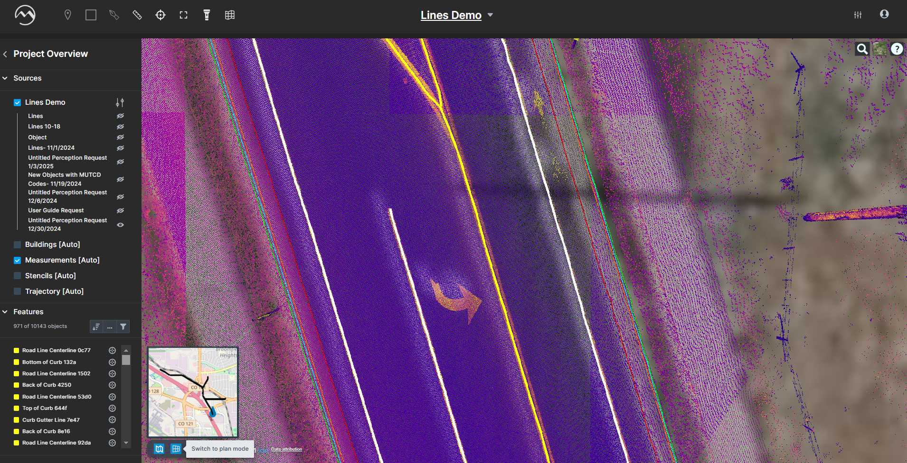<figcaption></figcaption></figure>
2.  **Tip: Manual Vertex Adjustments**\
    Grab and drag linear vertices to refine line positions.

    <figure>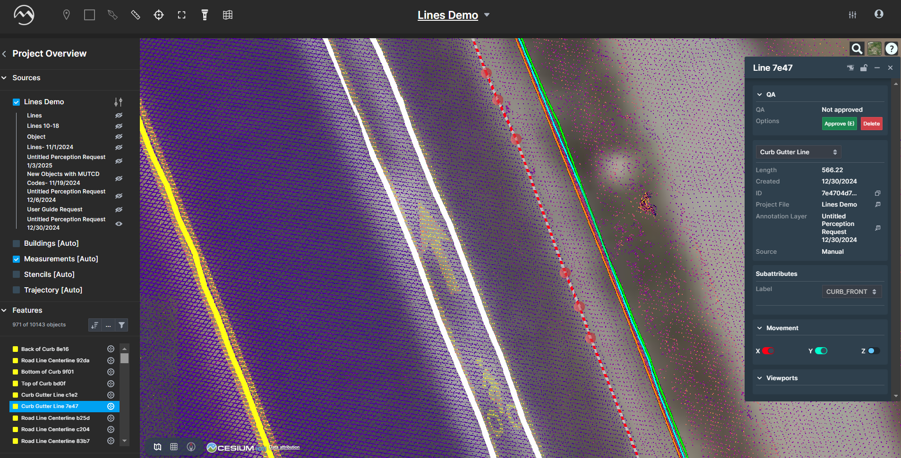<figcaption></figcaption></figure>
3.  **Tip: Merge Tool**\
    Right-click a line or press “M” to merge split segments of the same feature.

    <figure>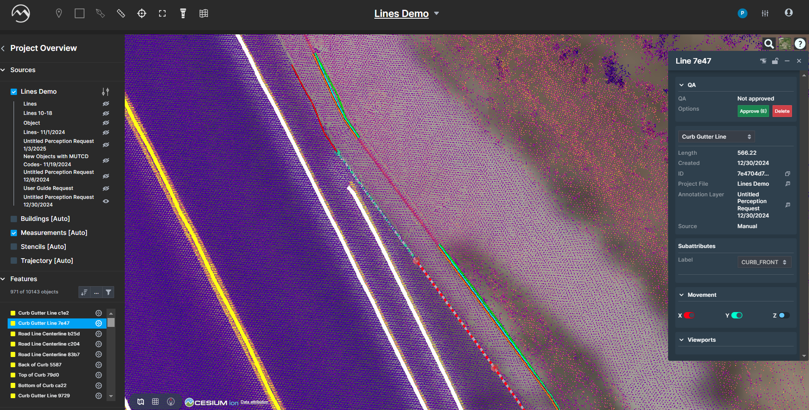<figcaption></figcaption></figure>
4.  **Tip: Context Menu Options**\
    Right-click on a line (not vertices) for duplicate, resample, or drape-to-ground actions.

    <figure>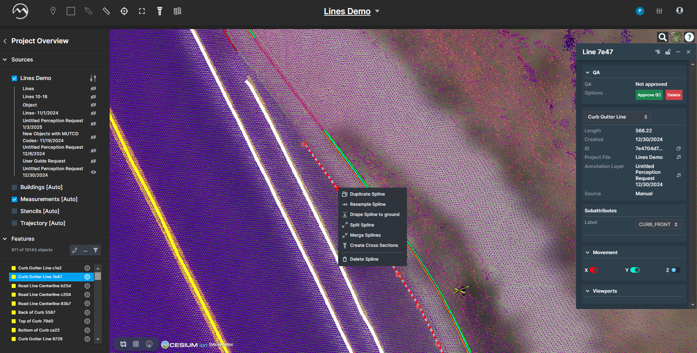<figcaption></figcaption></figure>
5.  **Tip: Cross Section Tool**\
    Use the cross section icon to inspect specific areas; view appears on the right.

    <figure>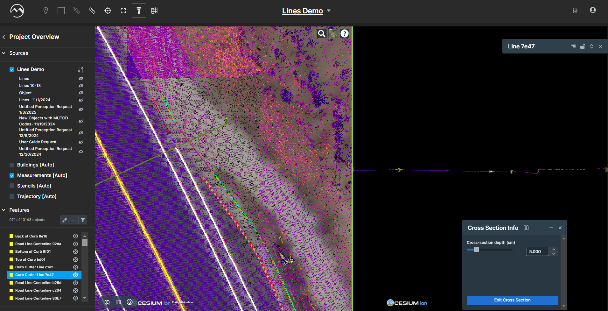<figcaption></figcaption></figure>
6.  **Tip: Auto-Join Tool**\
    Use Mass Select > “Merge Lines” to join multiple lines at once. Set deflection angle, gap tolerance, and dedupe threshold.

    <figure>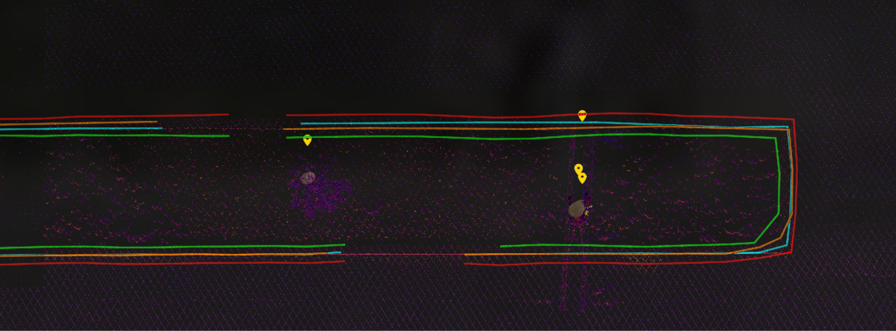<figcaption></figcaption></figure>

    <figure>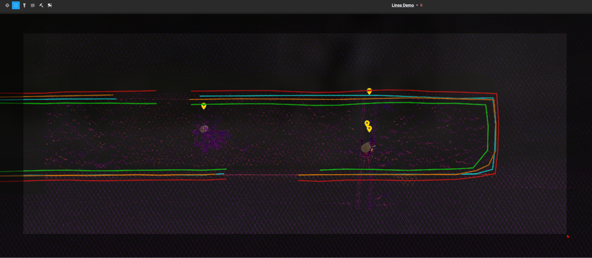<figcaption></figcaption></figure>
7.  **Step 2: Resample Centerlines**\
    Filter to show only centerlines and EOP; use Mass Select > “Resample Lines” with your interval/tolerance.

    <figure>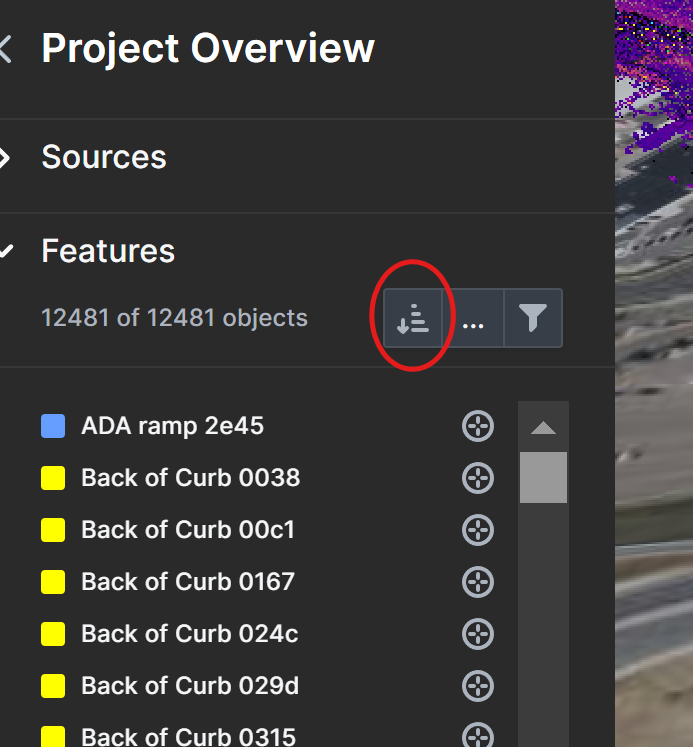<figcaption></figcaption></figure>
8. **Step 3: Resample Curbs**\
   Filter to show only curb lines; Mass Select > “Resample Lines” with desired settings.
9.  **Step 4: Stencilized Resample**\
    Draw a stencil by clicking to place vertices, press Space to finish, then choose uniform/manual/adaptive intervals.

    <figure>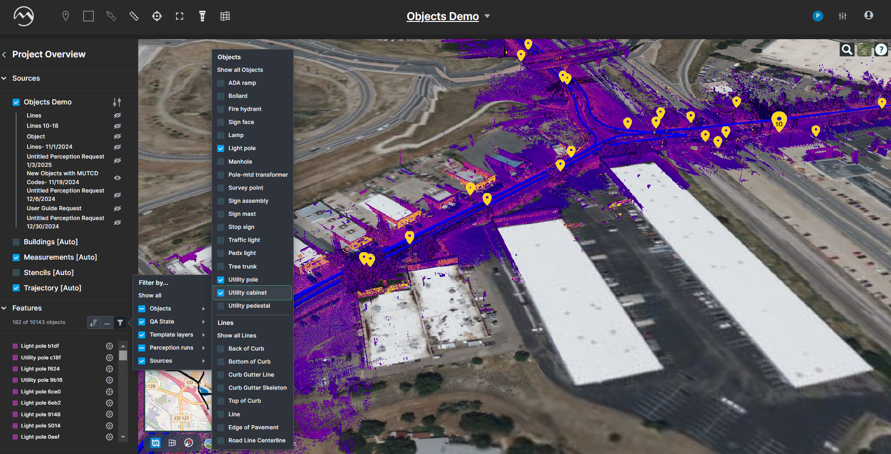<figcaption></figcaption></figure>
10. **Tip: Stencilized Settings**\
    Adjust window width and interval tolerance in the pop-up; hold Shift to snap to existing lines.

    <figure><figcaption></figcaption></figure>

    <figure>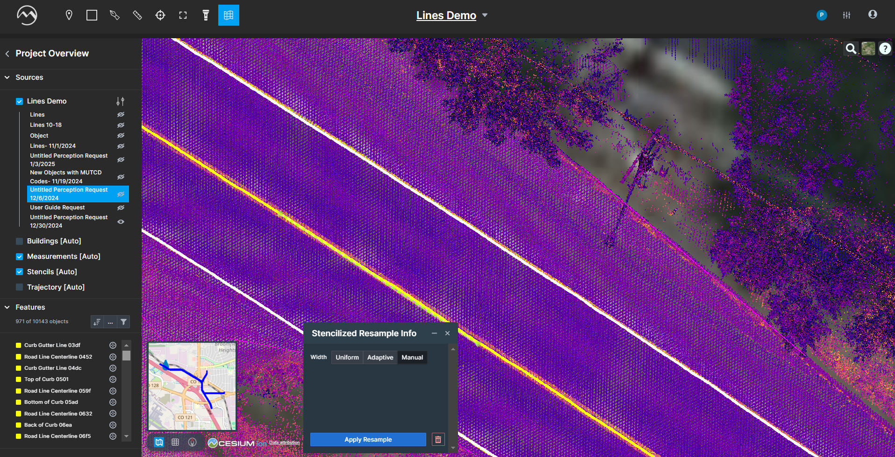<figcaption></figcaption></figure>
11. **Step 5: Refine Complex Sections**\
    Create smaller stenciled resamples on curb cuts or rounded corners for higher resolution.

    <figure>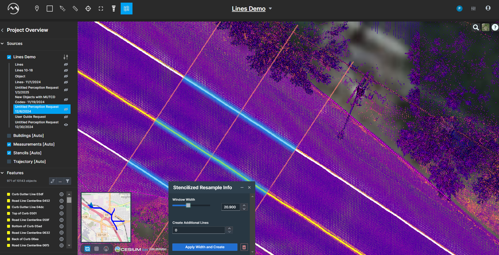<figcaption></figcaption></figure>

    <figure>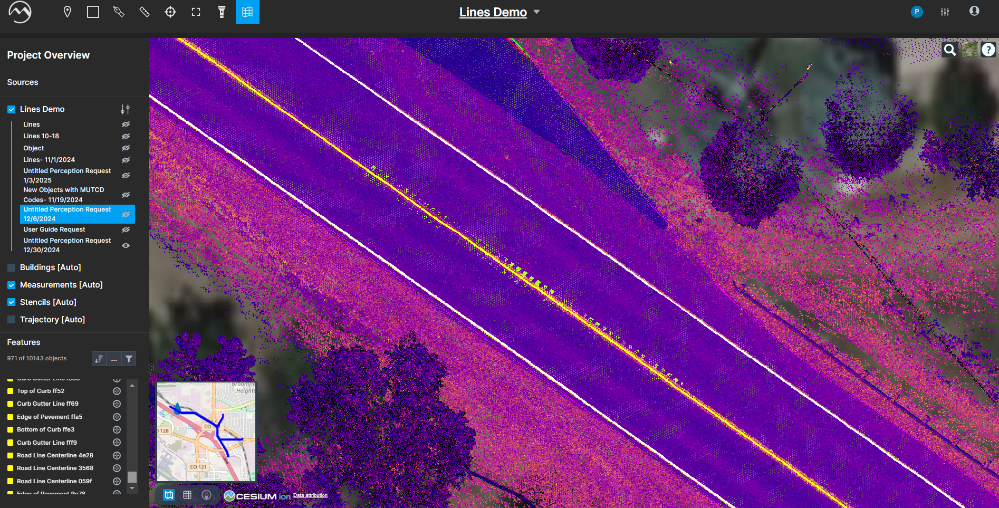<figcaption></figcaption></figure>
12. **Step 6: Approve Lines**\
    Once QA/QC is complete, click “Approve” or press “E” to mark lines as finalized.

    <figure>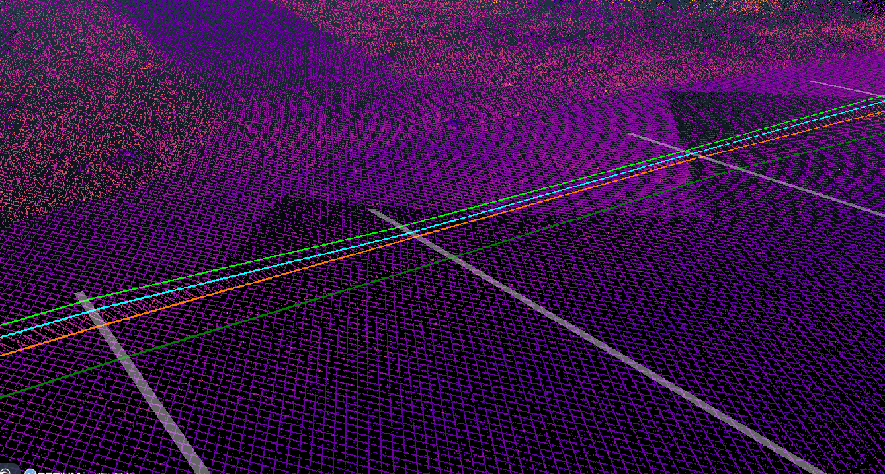<figcaption></figcaption></figure>

## Adding Linear Features

1.  **Manual Line Addition**\
    Select the Line icon on the top bar and draw features manually.

    <figure>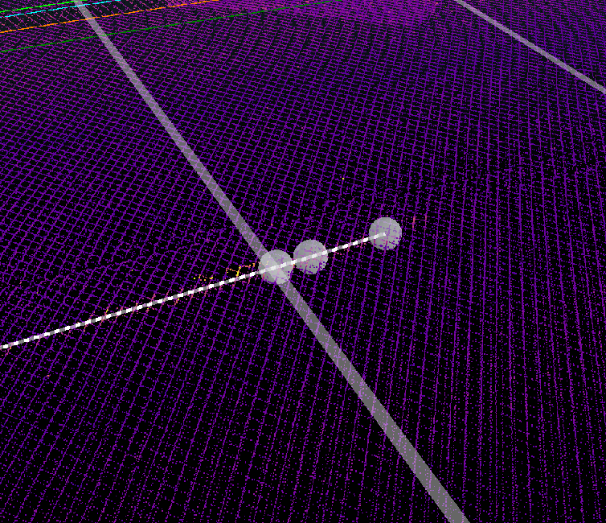<figcaption></figcaption></figure>
2.  **Cross Section Offset**\
    Right-click a line > “Create cross section,” place on point cloud to generate a parallel offset line.

    <figure>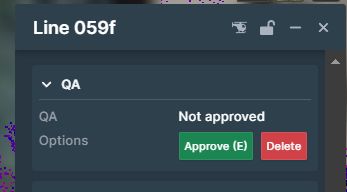<figcaption></figcaption></figure>

### Tips and Common Issues

> * Always start in Plan View for quick XY edits.
> * Use keyboard shortcuts (M, E, Shift) to speed up your workflow.
> * Document any manual edits for audit trails.
