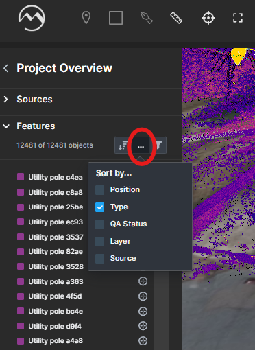
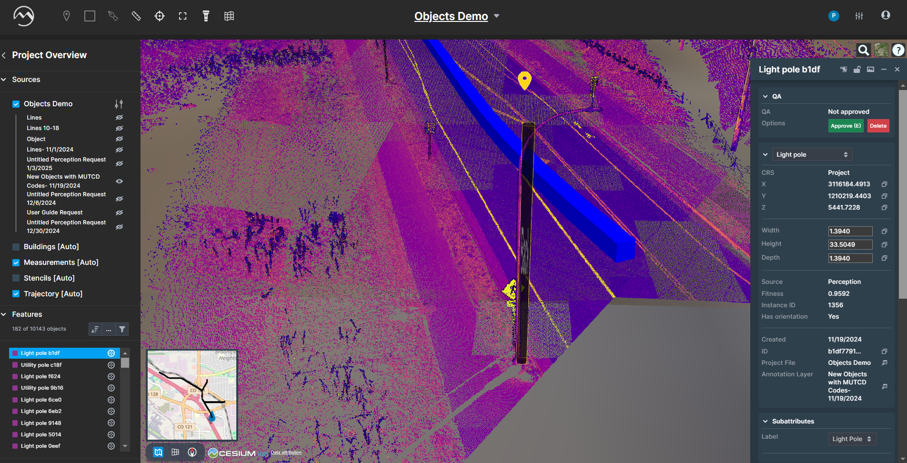
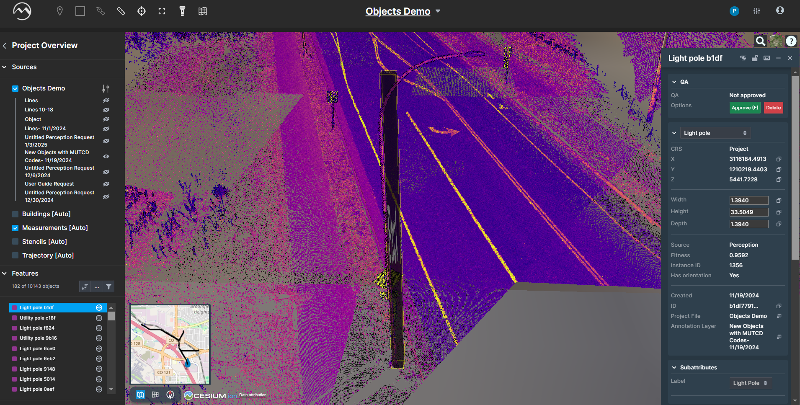
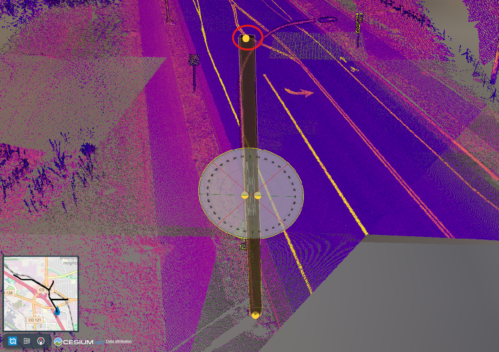
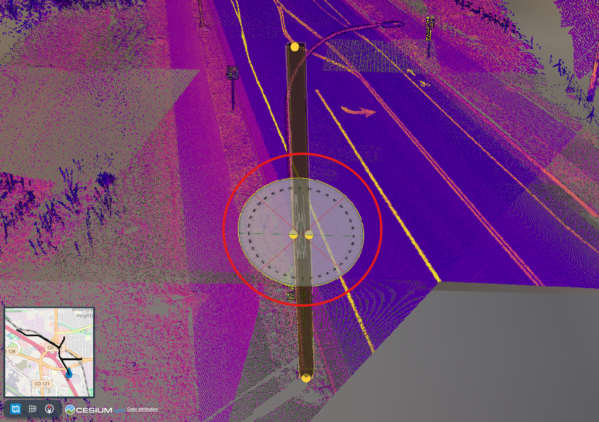
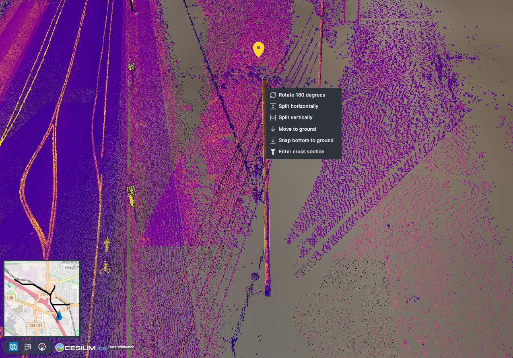
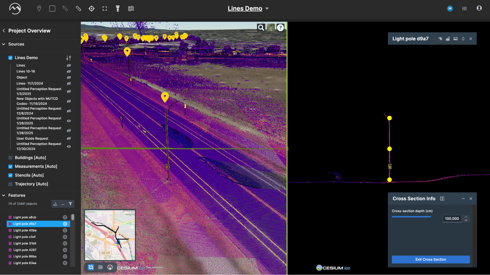
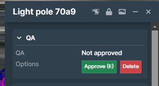

# Objects QA/QC Workflow

> The following QA/QC workflow lets you adjust, verify, and delete object features extracted in Digital Surveyor.

1.  **Step 1: Open Filters**\
    Once the dataset loads, click the filter icon at the bottom left to filter by objects, lines, QA state, template layers, perception runs, and sources.

    <figure><figcaption></figcaption></figure>
2.  **Step 2: Select Features**\
    Hover over the object's filter and choose which extracted features to view.

    <figure><figcaption></figcaption></figure>
3.  **Tip: Refine with Sort/Search**\
    Use “Sort by” or toggle ascending/descending to narrow your search.

    <figure><figcaption></figcaption></figure>

    <figure><figcaption></figcaption></figure>
4.  **Step 3: Fly to Feature**\
    In the **Features** table, click the crosshair icon or click the feature name and press “F” to fly to it.

    <figure><figcaption></figcaption></figure>
5.  **Step 4: Inspect & Edit**\
    Review the feature's info panel on the right. Select and drag to move the object. Then use the tools below to adjust before approval or deletion.

    <figure><figcaption></figcaption></figure>
6. **Tip: Lock Camera**\
   Click the lock icon or press “L” to orbit around the feature.
7. **Tip: View Imagery**\
   Click the **See image** icon or press “C” to access the extraction imagery.
8.  **Tip: Adjust Dimensions**\
    Drag the dimension nodes to resize the object.

    <figure><figcaption></figcaption></figure>
9.  **Tip: Rotate Feature**\
    Use the rotation wheel to change orientation; hold “Ctrl” to fix the pivot.

    <figure><figcaption></figcaption></figure>
10. **Tip: More Actions**\
    Right-click the feature for actions like rotate 180°, split horizontally/vertically, and more—see the full guide at[Editing Features](https://docs.mach9.io/docs/Editing-Features/).

    <figure><figcaption></figcaption></figure>
11. **Tip: Cross Section View**\
    Use the cross-section tool to verify subattributes from another perspective.

    <figure><figcaption></figcaption></figure>
12. **Step 5: Approve or Delete**\
    Click the green **Approve** or red **Delete** button—or press “E”/“R”—to update the QA state.

    <figure><figcaption></figcaption></figure>
13. **Step 6: Next Feature**\
    Click the next crosshair icon or press “+”/“–” to navigate through extracted features.

### Tips and Common Issues

> * Use keyboard shortcuts (F, L, C, E, R) to speed up QA/QC.
> * Document manual edits for audit trails.
> * Always verify subattributes via cross-section for accuracy.
