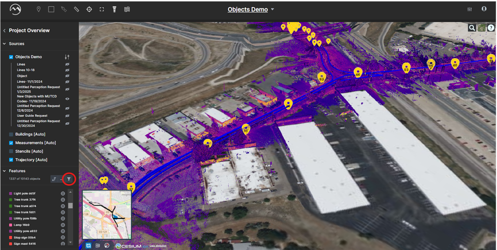

# QA/QC Workflows

This guide covers the three main QA/QC workflows in Digital Surveyor:

- Objects QA/QC
- Linear Features QA/QC
- Sign Assembly QA/QC

## Objects QA/QC Workflow

### Initial Setup

1. **Filter Features**\
   Use the filter icon in the bottom left to filter by:
   * Objects or lines
   * QA state
   * Template layers
   * Perception runs
   *   Sources

       <figure><figcaption></figcaption></figure>
2.  **Select Features**\
    Select specific features to review from the objects filter

    <figure><figcaption></figcaption></figure>

### Navigation and Review

#### Navigation

> Navigation tools:
>
> * Sort by various attributes
> * Filter by QA state
> * Group by feature type
> * Search for specific features

#### Review

> Review process:
>
> * Check feature accuracy
> * Verify attributes
> * Validate geometry
> * Document issues

#### Correction

> Correction options:
>
> * Edit feature geometry
> * Update attributes
> * Split/merge features
> * Delete incorrect features

## Linear Features QA/QC

> The linear features workflow follows a similar process but focuses on:
>
> * Line segments
> * Connectivity
> * Attribute consistency
> * Geometric accuracy

1. **Line Review**
   * Check line continuity
   * Verify segment connections
   * Validate attributes
   * Document issues
2. **Corrections**
   * Adjust line geometry
   * Fix connectivity issues
   * Update attributes
   * Split/merge lines
3. **Validation**
   * Verify corrections
   * Check consistency
   * Document changes
   * Update QA state

## Sign Assembly QA/QC

> For sign assemblies, pay special attention to:
>
> * Component relationships
> * Assembly structure
> * Attribute completeness
> * Position accuracy

#### Components

> Component verification:
>
> * Check all parts present
> * Verify relationships
> * Validate geometry
> * Document missing parts

#### Assembly

> Assembly validation:
>
> * Verify structure
> * Check connections
> * Validate orientation
> * Document issues

#### Attributes

> Attribute review:
>
> * Check completeness
> * Verify values
> * Validate relationships
> * Document corrections

## Best Practices

> Follow these best practices for QA/QC:
>
> * Use consistent review process
> * Document all changes
> * Verify corrections
> * Maintain QA state
> * Regular progress updates
