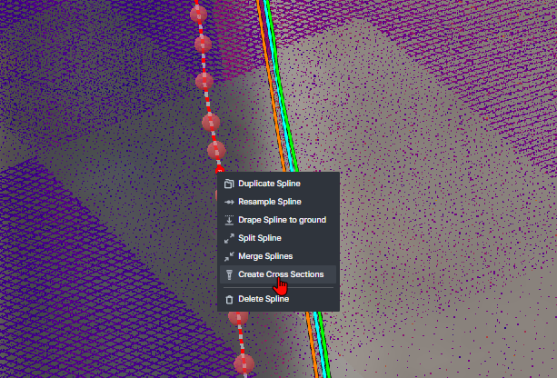

# Sign Assembly Troubleshooting

> Use this guide to resolve common issues encountered during sign assembly extraction and QA/QC.

1.  **Color Mismatch**\
    If a sign assembly and the signs above don't match in color, select the sign and click the blue icon at the bottom right, then choose the corresponding assembly. The sign will turn yellow.

    <figure><figcaption></figcaption></figure>
2.  **Add Missing Assembly**\
    If a sign has no assembly, select the sign face and click the green "+" icon to create a new assembly. The sign will turn green.

    <figure><figcaption></figcaption></figure>

    <figure><figcaption></figcaption></figure>
3.  **Break Links**\
    To unlink a sign from an assembly, select the sign face and click the red "Trash Can" icon. The sign will turn red.

    <figure><figcaption></figcaption></figure>

### Common Problems and Solutions

<!-- List common troubleshooting problems here -->
<!-- Provide troubleshooting solutions here -->
